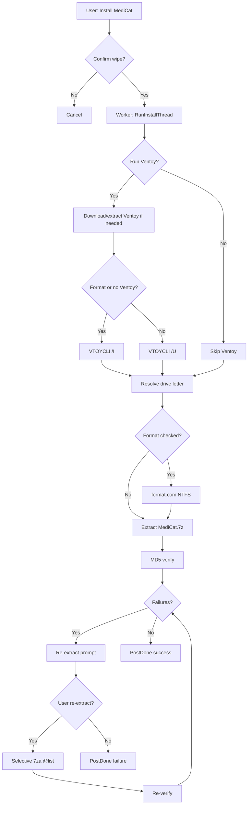

# MediCat Installer — Architecture & Project Outline

Native Windows (Win32) installer for MediCat USB bootable media. Everything lives on `main`, next to the Linux script (`linux/`) and the shared `spec/`.  
User-facing overview: [`README.md`](../README.md) · Feature parity: [`FEATURES.md`](FEATURES.md) · Roadmap: [`TODO.md`](TODO.md)

---

## Project outline

```
medicat_installer/
├── src/                    # C++ application (namespace medicat)
│   ├── main.cpp            # wWinMain → RunApp → App::RunParsed
│   ├── app.cpp / app.h     # Orchestration, worker threads, verify/re-extract, headless runs
│   ├── cli.cpp             # Flag parsing, console output, /help /version /list-* /dump-config
│   ├── gui.cpp / gui.h     # Main window, dialogs, progress, status bar
│   ├── theme.cpp           # Dark GDI+ controls
│   ├── drives.cpp          # USB / VHD / fixed-disk enumeration
│   ├── ventoy.cpp          # Ventoy download, extract, VTOYCLI /I /U
│   ├── archive.cpp         # Locate the MediCat .7z, size and MD5 checks, ready-to-install gate
│   ├── extract.cpp         # 7za subprocess (full + selective @list)
│   ├── verify.cpp          # Parallel MD5 against MedicatFiles.md5, presence check, SHA hashing
│   ├── extras.cpp          # Extras catalog: download, checksum, unpack into Extras/<category>/
│   ├── support.cpp         # Telemetry consent, session reports, failure-log upload
│   ├── bundle.cpp          # Embedded 7za, aria2c, MD5 resources
│   ├── download.cpp        # aria2c file downloads + WinHTTP (API, fallback)
│   ├── offline.cpp         # offline/ cache paths for Ventoy and the archive
│   ├── cancel.cpp          # Ctrl+C handling, cancel state, tracked child processes
│   ├── failure_tracker.cpp # Counts failed runs for the help gate
│   ├── sim_fail.cpp        # Debug menu: simulated failures and safety flags
│   ├── debug.cpp           # System/installer diagnostics → medicat_installer.log
│   ├── log.cpp             # Logger (file + optional console mirror)
│   ├── i18n.cpp            # Runtime translation lookup
│   ├── util.cpp            # Paths, file helpers, logs/ rotation
│   ├── i18n_generated.h    # Generated from i18n/translations.json (do not edit)
│   └── spec_generated.h    # Generated from spec/*.json (do not edit)
├── spec/                   # Shared spec: medicat.json, extras.json, torrent (spec/README.md)
├── linux/                  # Medicat_Installer.sh with its README and CHANGELOG
├── i18n/
│   └── translations.json   # EN, ES, FR, PL, TR source strings
├── tools/
│   ├── gen_spec.py         # spec/*.json → spec_generated.h + the block in the Linux script
│   ├── i18n_codegen.py     # translations.json → i18n_generated.h
│   ├── bump_build_number.py# build_number.txt + generated/build_version.cpp
│   ├── fetch_ventoy_versions.py
│   ├── prepare_md5_bundle.py / prepare_aria2_bundle.py / prepare_discord_icon.py
│   ├── generate_ingest_token.py
│   ├── sync_upstream.sh    # Merge the upstream project into main
│   └── populate_offline.py # Optional offline cache setup
├── res/
│   ├── bundle.rc.in        # Icons, VERSIONINFO and the embedded binary resources
│   ├── icon.*, discord.*   # Application and Discord icons
│   ├── app.manifest        # Reference copy only; the UAC level is set by the linker flag in CMakeLists.txt
│   └── ventoy_versions.txt # Fallback version list
├── tests/
│   ├── windows/            # test_main.cpp (MedicatTests.exe), smoke_cli.ps1 (VHD smoke test)
│   └── linux/              # smoke_test.sh
├── cmake/unified/          # Superbuild: one configure builds x64 and Win32
├── .github/workflows/      # ci.yml, upstream-sync.yml
├── docs/                   # This file, FEATURES.md, TODO.md, CLI.md, ...
├── bin/7z/                 # 7za.exe (x64, x32), embedded at build time
├── bin/aria2/              # aria2c.exe fetched at build time (gitignored)
├── generated/, build/      # Build output (gitignored)
├── MedicatFiles.md5        # Verification manifest (bundled)
├── CMakeLists.txt
├── rebuild.bat
└── README.md
```

**Runtime layout (beside exe):** `logs/` (`medicat_installer.log`, the tool logs and `failed_files.txt`; earlier sessions rotate into `logs/archive/<timestamp>/`), `Ventoy2Disk/` after Ventoy download, optional `offline/` cache. MediCat `*.7z` is user-supplied or downloaded via UI. Preferences live in `%AppData%\MedicatInstaller\preferences.json`.

---

## Layered design

| Layer | Modules | Responsibility |
|-------|---------|----------------|
| **Entry** | `main`, `cli`, `App` | Flag parsing, startup, bundle extract, wire GUI handlers or run headless |
| **UI** | `gui`, `theme` | HWNDs, user input, thread-safe updates via `WM_APP` |
| **Workflow** | `app` | Install / verify / extras sequences, confirmations, `PostDone`, exit codes |
| **Domain** | `drives`, `ventoy`, `archive`, `extract`, `verify`, `extras` | Drive identity, archive and image handling, tooling subprocesses |
| **Infrastructure** | `bundle`, `download`, `offline`, `support`, `cancel`, `log`, `debug`, `i18n` | Assets, network, telemetry, cancellation, diagnostics |

---

## Threading model

Long operations run on **detached `std::thread` workers**. The GUI thread owns all HWNDs.

```
Worker thread                          UI thread (gui.cpp WndProc)
─────────────────                      ───────────────────────────
RunInstallThread / RunVerifyThread
    │
    ├─ PostProgress(%)        ───────►  WM_MEDICAT_PROGRESS → SetProgress
    ├─ PostExtractProgress    ───────►  WM_MEDICAT_PROGRESS → NotifyExtractProgress
    ├─ PostStatusBar(text)    ───────►  WM_MEDICAT_PROGRESS (statusOnly) → SetStatusBar
    └─ PostDone(ok, msg)      ───────►  WM_MEDICAT_DONE → ShowDone + SetBusy(false)
```

**Rules**

- Never call `SetWindowText`, `SendMessage` to HWNDs, or GDI from workers.
- Listbox lines for file log: store strings in `fileLogDisplayLines_` (no temporaries to `LB_ADDSTRING`).
- `Gui::SetBusy(true)` disables inputs; `SetBusy(false)` restores Ventoy status on the status bar.

---

## Install flow (high level)



### Ventoy / format decision table

| Ventoy on drive | Format checkbox | Update Ventoy | Ventoy CLI |
|-----------------|-----------------|----------------|------------|
| No | Forced on (logic) | Forced on (logic) | `/I` |
| Yes | User choice | Unchecked | Skip Ventoy |
| Yes | User choice | Checked | `/U` (if format off) |
| Yes | Checked | Either | `/I` |

Detection: `{drive}\ventoy` folder **or** physical-disk layout matching Ventoy2Disk (`VTOYEFI` 32 MiB EFI partition at sector 2048 layout) via `TestVentoyInstalled`.

**UI vs logic:** When Ventoy is missing, checkboxes show checked state but stay **enabled**; `FormatChecked()` / `RunVentoyChecked()` enforce `true` via `RequiresForcedVentoyInstall()`. Drive-letter changes refresh labels/checks; toggling **Show all drives** does not.

---

## Verify flow

1. **Check USB Files** or post-install → `VerifyDriveFiles`
2. Parallel MD5 workers, `check.log` per file
3. On failure → `failed_files.txt` + re-extract window (`WM_MEDICAT_REEXTRACT_PROMPT`)
4. Optional `Extract7zArchiveSelective` → `reextract.log` → re-verify
5. Still failing → AV/firewall hint (`messages.verify_still_failed_after_reextract`)

---

## Custom messages (`gui.h`)

| Message | Payload | Purpose |
|---------|---------|---------|
| `WM_MEDICAT_PROGRESS` | `ProgressPayload*` | Progress, extract lines, status bar |
| `WM_MEDICAT_DONE` | `DonePayload*` | Operation finished |
| `WM_MEDICAT_VENTOY_VERSIONS` | version list | Populate Advanced combo |
| `WM_MEDICAT_REEXTRACT_PROMPT` | `ReExtractPromptPayload*` | Block worker on user choice |

---

## Build pipeline

1. **tools/bump_build_number.py** writes `build_number.txt` and `generated/build_version.cpp` (`rebuild.bat`: local counter + 1; CI: `1.0.<run number>`).
2. **cmake/unified** configures two ExternalProjects (x64 and Win32) of the root `CMakeLists.txt` and stages both exes into `build/Release/`.
3. Per architecture, custom commands run **gen_spec.py**, **i18n_codegen.py**, **fetch_ventoy_versions.py**, **prepare_md5_bundle.py**, **prepare_aria2_bundle.py**, **prepare_discord_icon.py** and **generate_ingest_token.py**.
4. **bundle.rc** (from `res/bundle.rc.in`) carries the icons, a VERSIONINFO block with the version from `build_number.txt`, `7za.exe`, gzipped `aria2c.exe` and the gzipped `MedicatFiles.md5`.
5. Output: `build/Release/MedicatInstaller.exe` and `MedicatInstaller-x86.exe` (single-file distribution; tools extracted to `%TEMP%\MedicatInstaller\{pid}\` at runtime). `-DMEDICAT_BUILD_TESTS=ON` adds `MedicatTests.exe`.
6. **Static CRT (`/MT`)** - no Visual C++ Redistributable required on end-user machines; the linker sets `requireAdministrator`.

---

## Logging

Everything is written to `logs/` beside the exe; the previous sessions rotate into `logs/archive/<timestamp>/`.

| File | Writer | When |
|------|--------|------|
| `medicat_installer.log` | `log.cpp`, `debug.cpp` | Every session (includes diagnostic sections) |
| `ventoy.log` | `ventoy.cpp` | Ventoy2Disk output during install or update |
| `extract.log` | `extract.cpp` | Full 7za extract |
| `reextract.log` | `extract.cpp` | Selective re-extract |
| `aria.log` | `download.cpp` | aria2c HTTP/torrent download |
| `check.log` | `verify.cpp` | MD5 pass/fail lines |
| `failed_files.txt` | `verify.cpp` | Verification failures |

Support upload after a failure (**`.log` / `.txt` only**, with consent): see [`SUPPORT_UPLOAD.md`](SUPPORT_UPLOAD.md).

---

## i18n

- Source: `i18n/translations.json` (five languages)
- Runtime: `i18n::Tr(L"key")` or `i18n::Tr(L"key", arg1, …)`
- **Add keys in all languages** before merging UI changes
- Rebuild regenerates `i18n_generated.h`

---

## Code conventions

- C++17, MSVC `/W4 /utf-8`, namespace `medicat`
- Wide strings for Windows paths and UI; UTF-8 in log files
- Extended paths `\\?\` in `verify.cpp` for long manifest paths
- MD5 buffers on heap (`std::vector<BYTE>`), not large stack arrays
- Match existing file style; avoid over-abstraction

---

## Simplification notes (for contributors)

### Already simplified

- **Forced Ventoy install** — single helper `RequiresForcedVentoyInstall()` drives getters, UI refresh, and re-check on click (no `EnableWindow` greying).
- **Drive refresh** — Ventoy/format controls update only when the **drive letter** changes, not when the drive list is rebuilt.

### Reasonable next refactors (not required)

| Area | Issue | Suggestion |
|------|-------|------------|
| `gui.cpp` (~5k lines) | Monolithic UI | Split: `gui_layout.cpp`, `gui_checkbox.cpp`, `gui_reextract.cpp` |
| `ProgressPayload` | Many bool flags | Small enum `ProgressKind { Percent, Extract, Status }` |
| `app.cpp` install thread | Long linear function | Named phases: `RunVentoyPhase`, `RunFormatPhase`, `RunExtractPhase` |
| Ventoy UI state | Label + check in one function | Table-driven `struct DriveVentoyUiState { labelKey; defaultChecked; }` |
| Confirm dialogs | Duplicated MessageBox patterns | Thin `ConfirmYesNo(hwnd, titleKey, messageKey, …)` helper |

### Avoid

- Porting PowerShell `form.Invoke` patterns — use message posting.
- Calling Win32 GUI APIs from worker threads.
- Committing `build/`, logs, `Ventoy2Disk/`, or `.7z` archives.

---

## Security / safety

- Destructive ops: wipe confirmation, Ventoy warning, drive-letter change confirmation
- Admin elevation required (`requireAdministrator`, set by the linker in `CMakeLists.txt`)
- MD5 reads full file; partial reads fail
- Internet needed for Ventoy download (offline cache supported); verify-only can use bundled manifest

---

## Branch reference

| Branch | Role |
|--------|------|
| `main` | The only long-lived branch: C++ Windows installer, Linux script (`linux/`) and the shared `spec/` |
